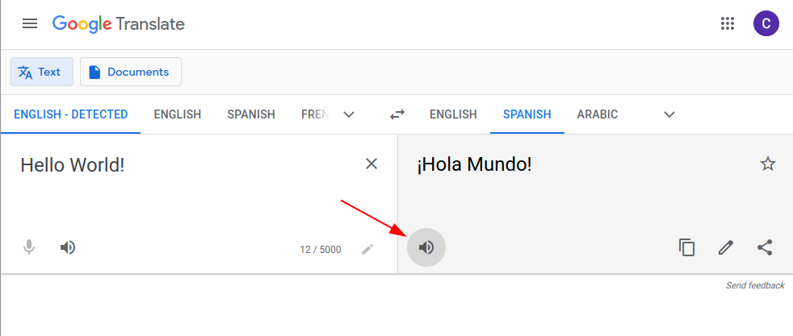

## Description

This is a text-to-speech (TTS) plugin for OpenVoiceOS (OVOS). It generates
speech through [gTTS](https://github.com/pndurette/gTTS), a library that
calls the undocumented speech endpoint behind [Google Translate](https://translate.google.com).

### Disclaimer

gTTS is not affiliated with Google or Google Cloud. Upstream changes can
break this plugin without notice. This plugin uses the undocumented Google
Translate speech endpoint and is different from [Google Cloud Text-to-Speech](https://cloud.google.com/text-to-speech/).

This plugin does exactly what your browser does when you press the speak
button in Google Translate. That puts its use in a legal gray area. It can
stop working at any time. Do not use it in production or for commercial
purposes.



## Install

```bash
pip install ovos-tts-plugin-google-tx
```

## Docker

A prebuilt image serves this plugin behind [ovos-tts-server](https://github.com/OpenVoiceOS/ovos-tts-server)
(an ElevenLabs-compatible HTTP API) on port `9666`:

```bash
docker run -p 9666:9666 ghcr.io/openvoiceos/ovos-tts-plugin-google-tx:dev
```

or with compose:

```bash
docker compose up
```

The served language defaults to `en`. Set it with the `GTTS_LANG` build arg:

```bash
docker build --build-arg GTTS_LANG=fr -t google-tx-tts .
```

The image needs no API key, but it does need network access at runtime.
gTTS synthesizes speech by calling `translate.google.com`, so the container
is not an offline voice.

## Configuration

```json
  "tts": {
    "module": "ovos-tts-plugin-google-tx"
  }
```

### Extra options

You can override the language. Otherwise the plugin uses the system
language.

```json
  "tts": {
    "module": "ovos-tts-plugin-google-tx",
    "ovos-tts-plugin-google-tx": {
      "slow": false,
      "lang": "fr",
      "tld": "ca"
    }
  }
```

Set the `tld` option to [force an accent](https://gtts.readthedocs.io/en/latest/module.html#localized-accents).
This option also helps when a network blocks `google.com` but allows a
local or different Google host.

The plugin recognizes the following regional accents and dialects, and
picks the matching `tld` for each:

```python
# https://gtts.readthedocs.io/en/latest/module.html#localized-accents
REGIONAL_CONFIGS = {
    "en-AU": {"lang": "en", "tld": "com.au"},
    "en-GB": {"lang": "en", "tld": "co.uk"},
    "en-US": {"lang": "en", "tld": "us"},
    "en-CA": {"lang": "en", "tld": "ca"},
    "en-IN": {"lang": "en", "tld": "co.in"},
    "en-IE": {"lang": "en", "tld": "ie"},
    "en-ZA": {"lang": "en", "tld": "co.za"},
    "en-NG": {"lang": "en", "tld": "com.ng"},
    "fr-FR": {"lang": "fr", "tld": "fr"},
    "fr-CA": {"lang": "fr", "tld": "ca"},
    "pt-BR": {"lang": "pt", "tld": "com.br"},
    "es-ES": {"lang": "es", "tld": "es"},
    "es-US": {"lang": "es", "tld": "us"},
    "es-MX": {"lang": "es", "tld": "com.mx"},
    "zh-CN": {"lang": "zh-CN"},
    "zh-TW": {"lang": "zh-TW"}
}
```

## Related projects

- [OpenVoiceOS/ovos-tts-server](https://github.com/OpenVoiceOS/ovos-tts-server) — the HTTP TTS server this plugin's Docker image runs behind.
- [OpenVoiceOS/ovos-plugin-manager](https://github.com/OpenVoiceOS/ovos-plugin-manager) — loads and configures TTS plugins for OVOS.

## License

Apache-2.0. See [LICENSE](./LICENSE).
